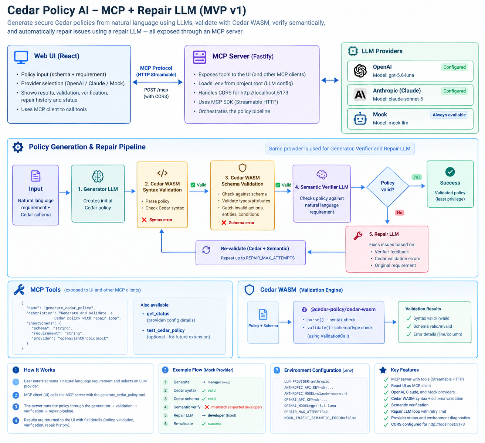

# AI Cedar Policy Studio

An MVP that converts natural-language authorization requirements into Cedar policies.

Pipeline:

Natural language
→ Generator LLM
→ Cedar WASM syntax/schema validation
→ Verifier LLM
→ Repair LLM (when verification fails)
→ Cedar WASM validation
→ Verifier LLM
→ Result



## Requirements

- Node.js 22+
- pnpm 10+
- OpenAI and/or Anthropic API key for real LLM mode (optional)

## Run

```bash
pnpm install
pnpm dev
```

Open http://localhost:5173.

The MCP server runs at http://localhost:3001/mcp.

## LLM providers

The application supports three providers:

- **OpenAI** — uses `OPENAI_API_KEY` and `OPENAI_MODEL`.
- **Claude (Anthropic)** — uses `ANTHROPIC_API_KEY` and `ANTHROPIC_MODEL`.
- **Mock** — local deterministic demo provider; no API key required.

Copy the example environment file:

```bash
cp .env.example .env
```

Configure one or both real providers:

```text
LLM_PROVIDER=mock

OPENAI_API_KEY=
OPENAI_MODEL=gpt-5.6-luna

ANTHROPIC_API_KEY=
ANTHROPIC_MODEL=claude-sonnet-5
```

`LLM_PROVIDER` is the fallback provider. The UI also lets you select a provider and model for each generation request.

### Per-stage LLM configuration

The generator, verifier, and repair stages are configured independently, so you
can generate with one model and verify with another (a different vendor makes
the verifier a genuine second opinion rather than the generator re-reading its
own work):

```text
LLM_GENERATOR_PROVIDER=anthropic
LLM_GENERATOR_MODEL=claude-sonnet-5

LLM_VERIFIER_PROVIDER=openai
LLM_VERIFIER_MODEL=gpt-5.6-luna

LLM_REPAIR_PROVIDER=anthropic
LLM_REPAIR_MODEL=claude-sonnet-5
```

Resolution order for each stage, most specific first:

1. the per-stage override in the request (the UI sends one per stage)
2. `LLM_<STAGE>_PROVIDER` / `LLM_<STAGE>_MODEL`
3. `LLM_PROVIDER` and `OPENAI_MODEL` / `ANTHROPIC_MODEL`

`LLM_REPAIR_*` inherits `LLM_GENERATOR_*` when unset, since repair is a
generation task. Omitting all stage variables reproduces the previous
single-provider behavior.

If neither real API key is configured, the application defaults to Mock.

API keys stay on the backend and are never sent to the React frontend.

## Provider status

The UI calls the MCP `get_status` tool and displays:

- available providers
- whether each provider is configured
- the resolved provider and model for each stage (generator / verifier / repair)
- the fallback provider

The per-stage selection is sent with each generation request, so changing a provider or model in the UI does not require restarting the application.

## Health check

```bash
curl http://localhost:3001/health
```

## API

### POST /api/policies/generate

```json
{
  "schema": "namespace App { ... }",
  "requirement": "Developers can write documents in their department.",
  "generator": { "provider": "anthropic", "model": "claude-sonnet-5" },
  "verifier": { "provider": "openai", "model": "gpt-5.6-luna" }
}
```

`provider` can be `openai`, `anthropic`, or `mock`, and applies to every stage that has no `generator`/`verifier`/`repair` override. If omitted, the configured `LLM_PROVIDER` or the first configured real provider is used.

## Architecture

- React + TypeScript + Vite
- Monaco editor
- Node.js + Fastify
- Cedar WASM
- OpenAI provider
- Anthropic/Claude provider
- Mock provider
- Zod validation

The LLM abstraction is provider-neutral, so the Cedar generation and semantic verification pipeline does not depend on a specific LLM vendor.

## Important

This is an MVP. The semantic verifier is an additional safety layer, not a security boundary. Before using generated policies in production, add authorization test generation/evaluation, human approval, audit logging, policy versioning, and strict input/output limits.


## Repair LLM

The pipeline includes an iterative repair loop. When the semantic verifier rejects a policy, the selected LLM is called as a Repair LLM with the schema, original requirement, current policy, verifier findings, and Cedar diagnostics. The repaired policy is validated deterministically with Cedar before being verified again.

Set `REPAIR_MAX_ATTEMPTS` to control the maximum number of repair iterations. `0` disables repair. The UI displays repair status and repair history. The repair stage has its own provider/model setting and defaults to the generator's, keeping provider behavior consistent unless you deliberately split them.

This follows a generate → validate → verify → repair → validate → verify self-correction pattern. Claude's documentation also describes separate-call self-correction as a useful pattern for complex prompts. citeturn0search0


### Demonstrate the repair loop with Mock

To test the full generate → verify → repair → verify loop without API credits, set:

```text
LLM_PROVIDER=mock
MOCK_INJECT_SEMANTIC_ERROR=true
REPAIR_MAX_ATTEMPTS=2
```

The Mock generator intentionally uses `manager` for a requirement that says `developer`. The Mock verifier detects the semantic mismatch, and the Mock Repair LLM changes the policy to `developer`, after which Cedar validation and semantic verification run again. Set `MOCK_INJECT_SEMANTIC_ERROR=false` for normal deterministic Mock behavior.


## MCP architecture

MVP v1 now exposes the application through an MCP server rather than a custom policy REST API. The main tools are:

- `generate_cedar_policy` — generator → Cedar syntax/schema validation → semantic verifier → Repair LLM loop.
- `get_status` — Cedar version and LLM provider configuration.

The web UI is an MCP client using Streamable HTTP. This keeps the policy pipeline behind a standard tool interface that can also be consumed by other MCP hosts.

The server uses the current MCP TypeScript SDK v2 packages and Streamable HTTP. The same MCP tool factory can also run over stdio with `pnpm --filter @nl2CedarPolicy/api mcp:stdio`.

### Environment file location

The API always loads the monorepo root `.env` file, regardless of whether you
start the server from the repository root or from `apps/api`. Set for example:

```env
LLM_PROVIDER=anthropic
ANTHROPIC_API_KEY=your-key
ANTHROPIC_MODEL=claude-sonnet-5
```

Restart the API after changing `.env`; environment variables are read when the
MCP server process starts. The `get_status` MCP tool reports the selected
provider and whether a provider key is configured, but never exposes the key.
