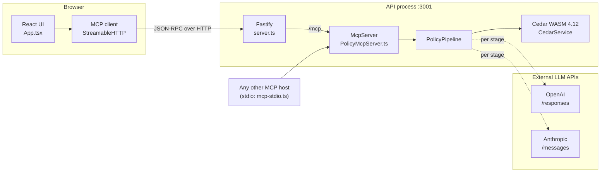
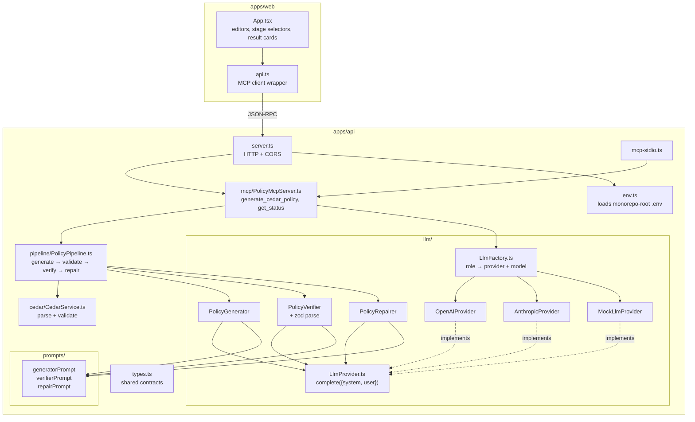
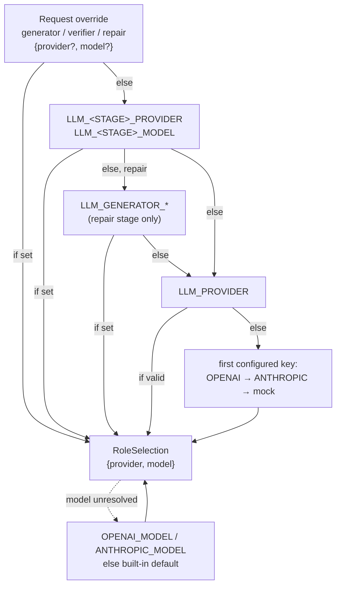
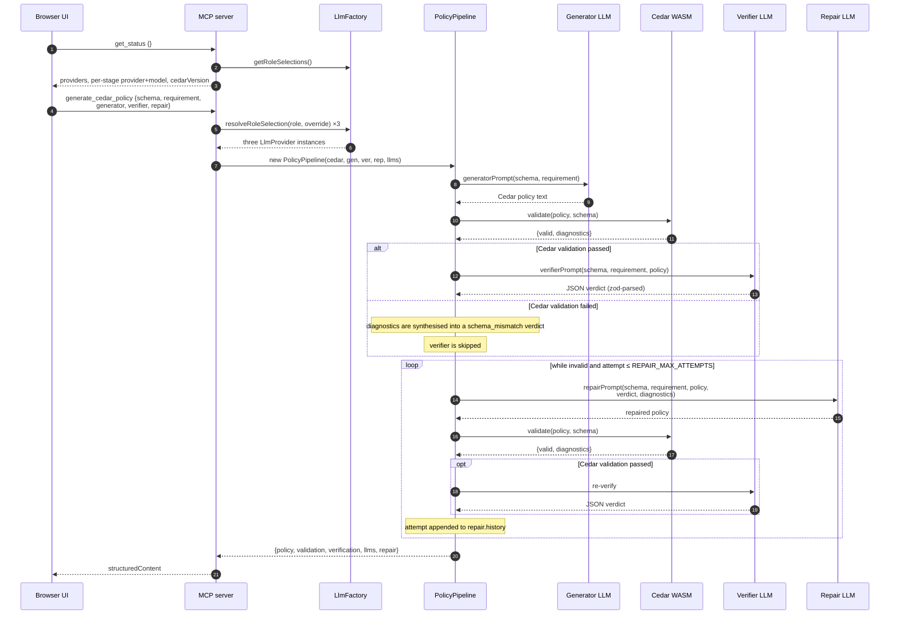
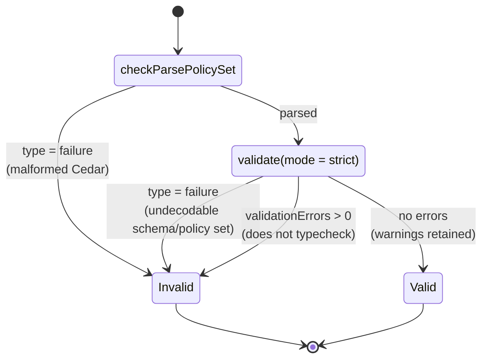

# AI Cedar Policy Studio — Technical Design

Status: MVP v1. Last updated 2026-09-15.

This document describes how the system is put together at the module level: the
runtime topology, the request path through the pipeline, the per-stage LLM
configuration model, and the deterministic Cedar validation layer.

For setup and environment variables, see the [README](../README.md).

---

## 1. Purpose and scope

The application turns a natural-language authorization requirement plus a Cedar
schema into a Cedar policy, then tries to establish that the policy actually
means what the requirement said.

Two independent checks run on every generated policy:

| Check | Kind | Authority |
| --- | --- | --- |
| Cedar syntax + schema validation | Deterministic (Cedar WASM) | Authoritative |
| Semantic verification | LLM judgement | Advisory |

The semantic verifier is a safety net, not a security boundary. A policy that
passes both checks is a *candidate* for human review, not an approved policy.

---

## 2. Runtime topology

Three processes in local development: the Vite dev server, the Fastify/MCP API,
and the browser. Cedar runs in-process inside the API as WASM; there is no
separate policy service and no database — every request is stateless.



Notes on the topology:

- The web UI is an **MCP client**, not a REST consumer. The same tool surface is
  reachable over stdio (`pnpm --filter @nl2CedarPolicy/api mcp:stdio`) so other
  MCP hosts can drive the pipeline.
- API keys live only in the API process. `get_status` reports *whether* a
  provider is configured and which model is selected, never the key itself.
- CORS for `/mcp` is written directly to `reply.raw` ([server.ts:34](../apps/api/src/server.ts#L34)),
  because the MCP node handler owns the raw socket and Fastify's reply is never
  flushed.

---

## 3. Module map



`LlmProvider` is a single method — `complete({system, user}) => Promise<string>`
([LlmProvider.ts](../apps/api/src/llm/LlmProvider.ts)). Everything above it is
prompt construction and response parsing; everything below it is vendor SDK
detail. That is what makes stages independently swappable.

---

## 4. Per-stage LLM configuration

The pipeline has three LLM stages, each configured separately. The intent is
that the verifier can be a *different* model — often a different vendor — from
the generator, so verification is a second opinion rather than the generator
re-reading its own work.



Resolution lives in `resolveRoleProvider` / `resolveRoleModel`
([LlmFactory.ts](../apps/api/src/llm/LlmFactory.ts)). Two properties worth
keeping when this code changes:

1. **Repair inherits the generator**, not the verifier — repair is a generation
   task, and it should default to whatever model is trusted to write policy.
2. **Provider and model resolve together.** `resolveRoleSelection` picks the
   provider first, then the model *for that provider*, so setting only
   `LLM_VERIFIER_PROVIDER=openai` yields an OpenAI model, never a stale
   Anthropic model name inherited from a different stage.

Omitting every `LLM_<STAGE>_*` variable reproduces the original
single-provider behavior exactly.

### Provider matrix

| Provider | Key | Default model | Call |
| --- | --- | --- | --- |
| `openai` | `OPENAI_API_KEY` | `OPENAI_MODEL` or `gpt-5.6-luna` | `responses.create` |
| `anthropic` | `ANTHROPIC_API_KEY` | `ANTHROPIC_MODEL` or `claude-sonnet-5` | `messages.create`, `max_tokens: 4096` |
| `mock` | — | `local-demo` | in-process, deterministic |

`createLlmProvider` throws if a stage selects a provider whose key is absent,
so a misconfiguration surfaces as a tool error rather than a silent fallback to
a different model than the one reported.

---

## 5. Request path



Two details that are easy to get wrong when editing
[PolicyPipeline.ts](../apps/api/src/pipeline/PolicyPipeline.ts):

- The verifier is **skipped** whenever Cedar validation fails. Asking an LLM to
  reason semantically about a policy that does not typecheck wastes a call and
  produces noise; `validationFailure()` converts the Cedar diagnostics into a
  `critical`/`schema_mismatch` verdict instead, which is exactly the input the
  repair prompt needs.
- The loop condition is `!validation.valid || !verification.valid`, so a repair
  attempt is spent on either kind of failure, and the loop exits as soon as both
  hold.

---

## 6. Deterministic Cedar layer

`CedarService` wraps `@cedar-policy/cedar-wasm` 4.12 and deliberately keeps two
operations apart ([CedarService.ts](../apps/api/src/cedar/CedarService.ts)):



- **Syntax** (`checkParsePolicySet`) is separated from **schema validation**
  (`validate`) so the pipeline can tell malformed Cedar from valid Cedar that
  violates the schema — a distinction the repair prompt uses.
- Cedar WASM 4.x returns externally tagged results (`{type: "success"} |
  {type: "failure", errors}`). A `failure` means the *input* could not be
  decoded; `validationErrors` on a success means the policy parsed but does not
  typecheck. Both collapse into `valid: false` for callers, with the
  distinction preserved in the diagnostic text.
- Validation runs in `strict` mode. Warnings do not fail a policy but are
  carried in `diagnostics` so the UI can show them.
- Schema is passed through as a Cedar-schema-format string; the FFI also accepts
  the JSON representation.

---

## 7. Data contracts

Shared shapes live in [types.ts](../apps/api/src/types.ts) and are mirrored
structurally in [apps/web/src/api.ts](../apps/web/src/api.ts). They are not
generated — a change to one needs the same change to the other.

### Tool input — `generate_cedar_policy`

```jsonc
{
  "schema": "namespace App { ... }",          // required
  "requirement": "Developers can write ...",  // required
  "provider": "anthropic",                    // optional per-request fallback
  "generator": { "provider": "anthropic", "model": "claude-sonnet-5" },
  "verifier":  { "provider": "openai",    "model": "gpt-5.6-luna" },
  "repair":    { "provider": "anthropic" }    // model omitted → provider default
}
```

Any stage without an override falls back to `provider`, then to the environment
chain in §4. The flat `provider` field is retained for compatibility with
callers written against the single-provider version.

### Tool output

```jsonc
{
  "policy": "permit ( ... );",
  "validation": { "valid": true, "diagnostics": [] },
  "verification": {
    "valid": true, "confidence": 0.92,
    "summary": "...",
    "issues": [{ "severity": "critical", "type": "wrong_condition", "description": "..." }]
  },
  "provider": "anthropic",      // = llms.generator.provider, compatibility field
  "llms": {
    "generator": { "provider": "anthropic", "model": "claude-haiku-4-5-20251001" },
    "verifier":  { "provider": "anthropic", "model": "claude-sonnet-5" },
    "repair":    { "provider": "anthropic", "model": "claude-sonnet-5" }
  },
  "repair": {
    "enabled": true, "attempts": 1, "maxAttempts": 2, "repaired": true,
    "history": [{ "attempt": 1, "policy": "...", "validation": {}, "verification": {} }]
  }
}
```

`llms` reports what actually ran, after resolution — the UI renders it rather
than echoing what it requested, so a fallback is visible instead of hidden.

### Verifier response parsing

The verifier is prompted to return JSON only and its output is parsed with a
zod schema ([PolicyVerifier.ts](../apps/api/src/llm/PolicyVerifier.ts)).
`JSON.parse` and `zod.parse` both throw on malformed output, which propagates
as a tool error. This is intentional for an MVP: a verifier whose verdict could
not be read must not be reported as a pass. Enumerated `severity` and `type`
values keep the UI's grouping stable.

---

## 8. Mock provider

`MockLlmProvider` lets the whole loop run with no API credits and no network.
It routes on a distinctive phrase in the system prompt — `"policy repair
specialist"`, `"security-focused Cedar policy reviewer"`, otherwise generator
([MockLlmProvider.ts](../apps/api/src/llm/MockLlmProvider.ts)). Editing those
phrases in `prompts/` breaks mock routing; keep them in sync.

`MOCK_INJECT_SEMANTIC_ERROR=true` makes the mock generator emit `manager` where
the requirement said `developer`. The mock verifier detects the mismatch, the
mock repairer rewrites the role, and Cedar re-validates — exercising the full
generate → validate → verify → repair → validate → verify path deterministically.

Because stages are configured independently, the mock can also be mixed with a
real provider — for example a real generator against a mock verifier while
iterating on generator prompts.

---

## 9. Configuration reference

| Variable | Effect |
| --- | --- |
| `LLM_PROVIDER` | Fallback provider for stages with no specific setting |
| `LLM_GENERATOR_PROVIDER` / `_MODEL` | Generator stage |
| `LLM_VERIFIER_PROVIDER` / `_MODEL` | Verifier stage |
| `LLM_REPAIR_PROVIDER` / `_MODEL` | Repair stage; inherits generator when unset |
| `OPENAI_API_KEY`, `OPENAI_MODEL` | OpenAI credentials and default model |
| `ANTHROPIC_API_KEY`, `ANTHROPIC_MODEL` | Anthropic credentials and default model |
| `REPAIR_MAX_ATTEMPTS` | Repair iterations; `0` disables the loop |
| `MOCK_INJECT_SEMANTIC_ERROR` | Forces a mock semantic defect for demos |
| `PORT`, `ALLOWED_ORIGINS` | API port and CORS origins for `/mcp` |
| `VITE_MCP_URL` | MCP endpoint the browser client connects to |

`env.ts` resolves the monorepo-root `.env` relative to its own source file, not
`process.cwd()`, so `pnpm dev` from the root and `pnpm --filter ... dev` from
`apps/api` behave identically. Environment variables are read at process start
and at request time via `process.env`; changing `.env` requires an API restart.

---

## 10. Known limitations

These are MVP boundaries, not bugs — worth stating so nobody depends on
behavior that was never designed.

- **No authorization testing.** The pipeline never evaluates the policy against
  concrete principals/resources. A generated policy can typecheck and read
  correctly and still be wrong for real requests.
- **The verifier is advisory.** It shares a vendor and often a model family with
  the generator unless deliberately configured otherwise; correlated blind spots
  are possible. Splitting vendors across stages (§4) reduces but does not
  eliminate this.
- **No persistence.** No policy versioning, audit log, or approval record.
  Every request is independent.
- **No input or output limits.** Schema and requirement text go to the provider
  unbounded; a large schema can exceed context or cost more than expected.
- **Repair is bounded but not monotonic.** Nothing guarantees attempt *n+1* is
  closer than attempt *n*; the loop simply stops at `REPAIR_MAX_ATTEMPTS`.
- **Contracts are hand-mirrored** between `apps/api/src/types.ts` and
  `apps/web/src/api.ts`.
- **One pre-existing type error**: [env.ts:12](../apps/api/src/env.ts#L12)
  compares `result.error.code` with `"ENOENT"`, which is absent from dotenv's
  error-code union, so `pnpm typecheck` fails in `apps/api`.

Before production use, the gaps that matter most are authorization test
generation and evaluation, human approval, audit logging, policy versioning, and
strict input/output limits.
